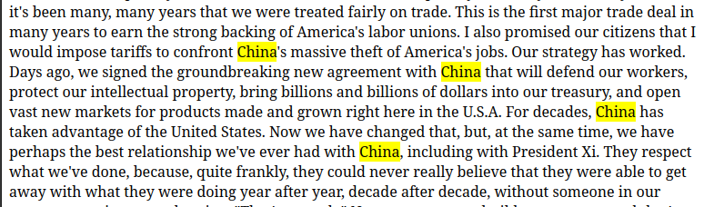
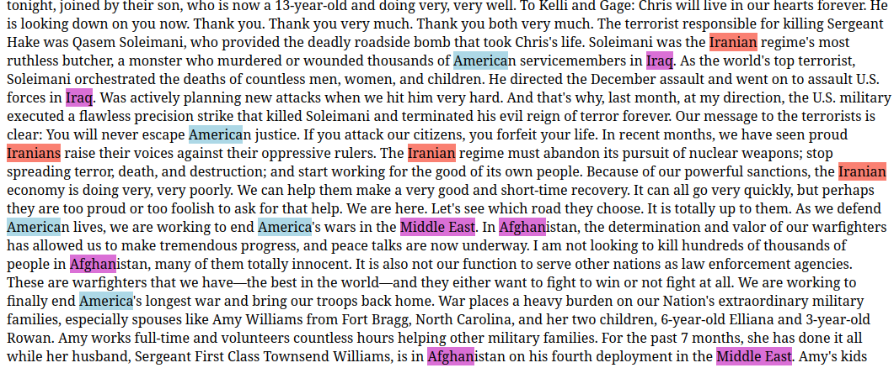

```{r, include = FALSE}
knitr::opts_chunk$set(
  collapse = TRUE,
  comment = "#>"
)
```

Coding text, annotate text or text tagging in qualitative analysis means: 


> “Coding means that we attach labels to segments of data that depict what each segment is about. Through coding, we raise analytic questions about our data from […]. Coding distills data, sorts them, and gives us an analytic handle for making comparisons with other segments of data” (Charmaz, 2014:4).

> “Coding is the strategy that moves data from diffuse and messy text to organized ideas about what is going on” (Richards and Morse, 2013:167).

> "Coding is a core function in ATLAS.ti that lets you “tell” the software where the interesting things are in your data. ... the main goal of categorizing your data is to tag things to define or organize them. In the process of categorization, we compare data segments and look for similarities. All similar elements can be grouped under the same name. By naming something, we conceptualize and frame it at the same time" (Friese, 2019).
> Font: [Atlas.ti manual](https://doc.atlasti.com/QuicktourWin.v9/Codes/CodingData.html)


The goal of {codifyR} is to tag text with categories. Coding text with colors, according to a category, make it easy to read and find what you want in a text, understanding better what is going on.


Loading the package

```{r example}
library(codifyR)
## basic example code
```

## Example: SOTU 

The [sotu package](https://cran.r-project.org/web/packages/sotu/index.html) contains the SOTU data, it is commonly used in text analysis examples, but any text data can be used as input.

> "The President of the United States is constitutionally obligated to provide a report known as the 'State of the Union'. The report summarizes the current challenges facing the country and the president's upcoming legislative agenda." [source](https://cran.r-project.org/web/packages/sotu/index.html)

```{r sotu}
library(sotu)
# the metadata, to see which discourse we want.
sotu_meta
text <- sotu_text[240]
# using substr to see just the first n characters of text
text  |> substr(1,900)
```
<!-- If you are not using Rstudio, or if you are using and want to open it in your webbrowser instead of the RStudio, use option. -->
```{r option}
```

Checking if the word we want exist in text
```{r string detect}
word_wanted = "China"
text |> stringr::str_extract_all(word_wanted)
```
Yes! It exist in text and occurs 5 times.
Now let's codify/tag or simply color the words we want.

```{r page_html }
page_html <- text |> 
  color_text(pattern = "China", ) |>
  build_html(title_page = "SOTU - Trump")
```
Now saving the file
```{r writeLines html TRUE}
#| echo: false
#| eval: false
writeLines(page_html, "./inst/sotu.html")
```
```{r writeLines html FALSE}
#| eval: false
writeLines(page_html, "sotu.html")
```
If we open the sotu.html file in the webbrowser (Firefox, Chrome, Safari, etc.), this give us:



We can also increment it even more.
The color names must be the color names availabe in .html, not the R color names availabe in `colors()`. There are 140 avaialable in all of them. Check the [complete list here](https://www.w3schools.com/colors/colors_names.asp). Even better is to use the hex color instead of names.
<!-- To check the color names in R, run `colors()` command, or check [this link](https://r-charts.com/colors/), or [this](http://www.stat.columbia.edu/~tzheng/files/Rcolor.pdf), or search in internet for "R color palettes". -->
For pattern, is possible to use regular expressions.
The parameter mouseover_txt shows the text that will be shown when the mouse is over the word.

```{r page_html vários color text }
page_html <- text |> 
  color_text(pattern = 
    "(?i)\\b(Chin|Iran|North Korea|Venezuela)\\w*\\b", # Regex pattern
    color_txt = "salmon", 
    mouseover_txt = "Countries taken as enemies" ) |>
  color_text(pattern = "USA|U\\.S\\.|U\\.S\\.A\\.|America|United States", # Regex pattern
    color_txt = "lightblue", 
    mouseover_txt = "USA" ) |>
  color_text(pattern = 
    "(?i)\\b(Hispanic|Latin|Mexic|Cuba|Hondur|Hait|Guatemal|El Salvador|Nicaragua)", # Regex pattern
    color_txt = "lightgreen", 
    mouseover_txt = "latin" ) |>
  color_text(pattern = "(?i)\\b(Middle East|Afghan|Iraq|Syria)", # Regex pattern
    color_txt = "orchid", 
    mouseover_txt = "Middle East" ) |>
  # and given it is pure text, turn it into .html:
  build_html(title_page = "SOTU - Trump")
```

```{r writeLines html FALSE 2}
#| eval: false
writeLines(page_html, "sotu.html")
```

We go back to the webbrowser, and refresh it with F5 bottom. We get something like this:



Lets use the package [countrycode](https://github.com/vincentarelbundock/countrycode) to get information 

```{r}
library(countrycode)
```


# See also

The package [handcodeR](https://github.com/liserman/handcodeR/) open a web based app (Shiny), that allows to annotate text in a interactive way, specifying different categories. Its focus is to manually classify texts one by one. 
On the other hand, {codifyR} aims to tag categories of words into text, all at once.
It returns an .html file, that can be printed into PDF in your web browser.
